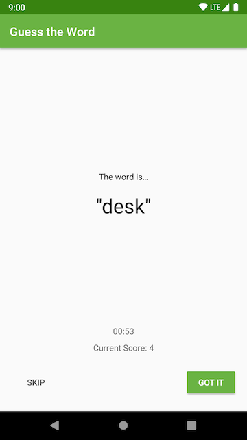

# Guess It! 🎯

> **STEP IT Academy** — Android Mobile Application Development (Kotlin + XML UI)
> Module 3 — App Architecture: ViewModel · LiveData · Data Binding

---

## Screenshots

  

---

## About the App

**Guess It!** is a word-guessing party game for 2+ players.

- Hold the device in **landscape mode**, screen facing away from you
- Your friends give you **clues** to describe the word on screen
- Press **Got It** if you guess correctly → +1 score
- Press **Skip** to pass → -1 score
- Game runs for **60 seconds**, then shows your final score

---

## Architecture

This project demonstrates the **MVVM (Model-View-ViewModel)** pattern using Android Architecture Components.

```
┌─────────────────────────────────────────────┐
│                   UI Layer                   │
│                                              │
│  TitleFragment → GameFragment → ScoreFragment│
│       ↕               ↕              ↕       │
│  (DataBinding)   (DataBinding)  (DataBinding)│
└──────────────────────┬──────────────────────┘
                       │ observes LiveData
┌──────────────────────▼──────────────────────┐
│               ViewModel Layer                │
│                                              │
│   GameViewModel          ScoreViewModel      │
│   - word (LiveData)      - score (LiveData)  │
│   - score (LiveData)     - eventPlayAgain    │
│   - currentTime          ScoreViewModelFactory│
│   - eventGameFinish                          │
│   - buzzEvent                                │
└─────────────────────────────────────────────┘
```

### Key Concepts

| Concept | Implementation |
|---|---|
| ViewModel | Survives configuration changes (rotation) |
| LiveData | Reactive UI updates, lifecycle-aware |
| LiveData Encapsulation | `MutableLiveData` private, exposed as `LiveData` |
| Transformations.map | Format timer countdown string |
| ViewModelFactory | Pass score argument to ScoreViewModel |
| DataBinding | `@{}` expressions bind ViewModel data directly to XML |
| Navigation SafeArgs | Type-safe score argument passed to ScoreFragment |
| CountDownTimer | 60-second game timer, cancelled in `onCleared()` |
| Haptic Feedback | Vibration patterns for correct answer, panic, game over |

---

## Project Structure

```
app/src/main/java/com/example/android/guesstheword/
├── MainActivity.kt
└── screens/
    ├── game/
    │   ├── GameFragment.kt          ← Observes ViewModel, handles vibration
    │   └── GameViewModel.kt         ← Timer, word list, score logic
    ├── score/
    │   ├── ScoreFragment.kt         ← Shows final score
    │   ├── ScoreViewModel.kt        ← Holds score, play-again event
    │   └── ScoreViewModelFactory.kt ← Factory to pass score to ViewModel
    └── title/
        └── TitleFragment.kt         ← Start screen

app/src/main/res/
├── layout/
│   ├── main_activity.xml            ← NavHostFragment container
│   ├── game_fragment.xml            ← Word, timer, score, buttons (DataBinding)
│   ├── score_fragment.xml           ← Final score display (DataBinding)
│   └── title_fragment.xml           ← Play button
├── navigation/
│   └── main_navigation.xml          ← Nav graph with SafeArgs
└── anim/
    ├── slide_in_right.xml
    └── slide_out_left.xml
```

---

## Tech Stack

| Component | Library | Version |
|---|---|---|
| Build System | Android Gradle Plugin | 9.0.1 |
| Language | Kotlin (bundled with AGP) | — |
| UI Navigation | Navigation Component | 2.9.7 |
| Safe Args | Navigation SafeArgs | 2.9.7 |
| ViewModel | Lifecycle ViewModel KTX | 2.9.0 |
| LiveData | Lifecycle LiveData KTX | 2.9.0 |
| UI Binding | DataBinding | built-in |
| Min SDK | Android 7.0 (Nougat) | API 24 |
| Target SDK | Android 16 | API 36 |

---

## Build Requirements

| Tool | Version |
|---|---|
| Android Studio | Meerkat or newer |
| Gradle Wrapper | 9.2.1 |
| JDK | 21 (Embedded JDK in Android Studio) |

> **JDK Setup:** Go to `File → Settings → Build Tools → Gradle → Gradle JDK`
> and select **Embedded JDK** (`…/Android Studio/jbr`)

---

## How to Work with This Repo

### Branch Structure

This repo has **23 branches** — one per exercise step:

```
main                                    ← Complete solution
Step.01-Exercise-Create-the-GameViewModel    ← Start here (has TODOs)
Step.01-Solution-Create-the-GameViewModel   ← Reference answer
Step.02-Exercise-Populate-the-GameViewModel
Step.02-Solution-Populate-the-GameViewModel
... (Step 03 – 11)
```

### Workflow Per Step

```bash
# 1. Checkout the Exercise branch
git checkout Step.XX-Exercise-<topic>

# 2. Open in Android Studio
#    Find TODOs via: View → Tool Windows → TODO

# 3. Complete all TODOs in order (they are numbered)

# 4. Compare with the Solution branch
git diff Step.XX-Solution-<topic>

# 5. Move to the next step
git checkout Step.XX+1-Exercise-<topic>
```

---

## Exercise Steps

| Step | Branch | Topic | Key Files |
|---|---|---|---|
| 01 | `Step.01-Exercise` | Create the GameViewModel | `GameViewModel.kt` |
| 02 | `Step.02-Exercise` | Populate the GameViewModel | `GameViewModel.kt`, `GameFragment.kt` |
| 03 | `Step.03-Exercise` | Add LiveData to GameViewModel | `GameViewModel.kt`, `GameFragment.kt` |
| 04 | `Step.04-Exercise` | Add LiveData Encapsulation | `GameViewModel.kt` |
| 05 | `Step.05-Exercise` | Add End Game Event | `GameViewModel.kt`, `GameFragment.kt` |
| 06 | `Step.06-Exercise` | Add the Timer | `GameViewModel.kt`, `GameFragment.kt` |
| 07 | `Step.07-Exercise` | Add a ViewModelFactory | `ScoreViewModel.kt`, `ScoreViewModelFactory.kt` |
| 08 | `Step.08-Exercise` | Add ViewModel to Data Binding | `game_fragment.xml`, `GameFragment.kt` |
| 09 | `Step.09-Exercise` | Add LiveData Data Binding | `game_fragment.xml`, `score_fragment.xml` |
| 10 | `Step.10-Exercise` | Map Transformation | `GameViewModel.kt` |
| 11 | `Step.11-Exercise` | *(Optional)* Add Buzzing | `GameViewModel.kt`, `GameFragment.kt` |

> Each Exercise branch has numbered `// TODO` comments.
> Each Solution branch shows the completed code.

---

## Navigation Flow

```
TitleFragment
    │  (Play button)
    ▼
GameFragment  ──────────────────────────────┐
(60s countdown)                             │
    │  (timer ends → eventGameFinish)        │
    ▼                                        │
ScoreFragment                               │
    │  (Play Again → eventPlayAgain)         │
    └────────────────────────────────────────┘
```

---

## Course Info

| | |
|---|---|
| **Academy** | STEP IT Academy |
| **Course** | Android Mobile Application Development (Kotlin + XML UI) |
| **Instructor** | Magn |
| **Batch** | Batch 1 · Module 3 (D13–D14) |
| **GitHub Org** | [chamkartechcambodia-sudo](https://github.com/chamkartechcambodia-sudo) |
